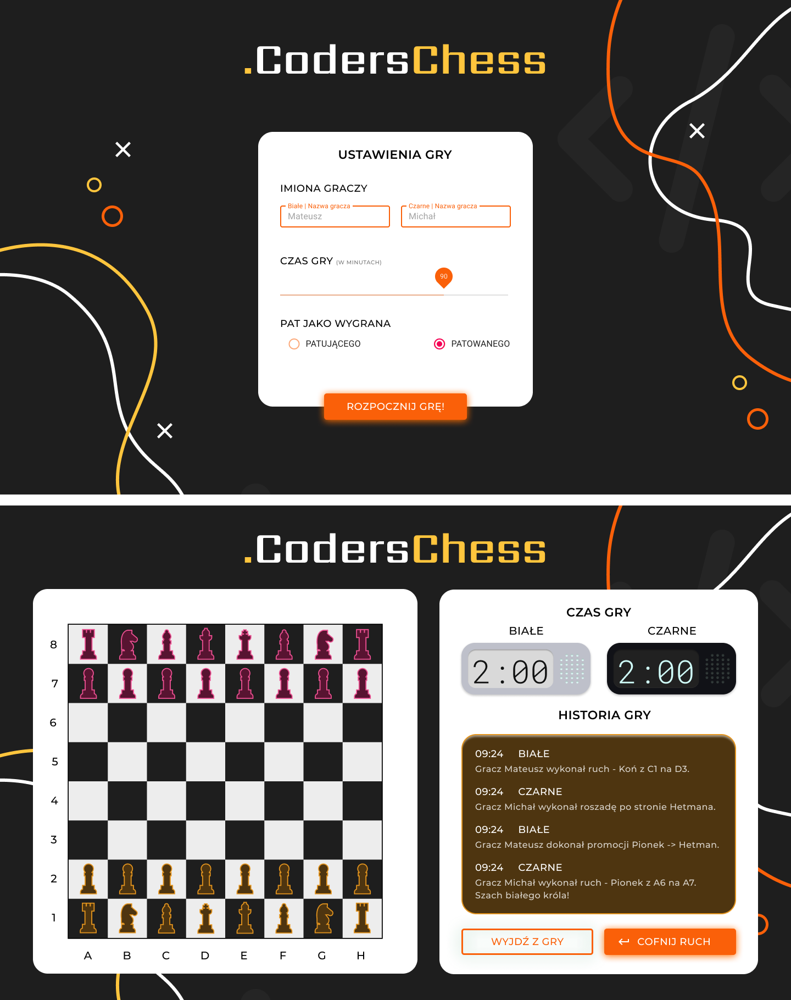

### Instrukcja dla mentora
Drogi mentorze, cały projekt, jak i wytyczne traktuj jako „wskazówki". 
Pamiętaj, że nadrzędnym celem na CodersCamp jest przekazać wiedzę i nauczyć :) 
Wszystko, co wg. Twojej najlepszej wiedzy, będzie służyć do osiągnięcia tego celu, możesz zastosować. 
Jednakże pamiętaj o trzymaniu się ogólnych wytycznych oceny i programu kursu (minimum musi zostać spełnione, abyśmy na koniec kursu mogli potwierdzić uczestnikom opanowanie umiejętności stosownym dokumentem).

Aby przygotować TEN projekt do wykonania przez zespół.
1. Sklonuj repozytorium.
2. Usuń branch z proponowanym rozwiązaniem, aby nie hamować kreatywności zespołu. 
Możesz się nią zainspirować albo wykonać projekt zupełnie inaczej. 
Dostarczamy Ci ten kod dla ułatwienia mentorowania, ale nie traktuj go jako jakiegoś _wyznacznika_, czy dobrego, albo _jedynego poprawnego_ rozwiązania.
3. Usuń instrukcję dla mentora z README.md
4. Spotkaj się z zespołem, aby przeprowadzić planning i potworzyć Issues przynajmniej na pierwszy tydzień.
Wyznaczony Development Manager niech organizuje pracę dalej, ale dobrze jakbyś był na spotkaniach planujących zadania.

# CodersCamp 2020 - Projekt TypeScript
Coders Camp (coderscamp.edu.pl) - Projekt TypeScript. 

Proponowany projekt — Szachy (opis poniżej).

### Zasady wykonywania projektu (wspólne dla wszystkich grup i mentorów): 

##### W projekcie każdy z uczestników powinien zaprezentować praktyczną znajomość poniższych zagadnień związanych z TypeScript:
- typy podstawowe
- definiowanie własnych typów
- składanie typów
- typy, klasy, interfejsy

##### W trakcie trwania projektu należy wyznaczyć w zespole następujące role
tak jak opisano w przypadku poprzedniego projektu.

##### Sposób oceny projektu (i wszystkich kolejnych projektów na CodersCamp)
tak jak opisano w przypadku poprzedniego projektu.

## Gra w Szachy
Teraz przechodzimy do przykładowego projektu, który został przygotowany przez organizatorów kursu.
Proponowany projekt pozwala na zastosowania większości umiejętności, jakie powinniście posiąśc w trakcie przerabiania działu.
Jednakże jeśli macie pomysł na projekt podobnej skali, który spełni opisane na górze wymagania i czujecie się na siłach
w zdefiniowaniu funkcjonalności, przygotowaniu ekranów i podzieleniu go na zadania — to nic nie stoi na przeszkodzie,
aby wykonać np. coś związanego z zainteresowaniami Waszej grupy :)
Przykładem może być też jakaś inna gra — np. Chińczyk. Niech nic nie stoi na przeszkodzie waszej kreatywności.
Pamiętajcie tylko, że czas jest ograniczony i musicie zdążyć z aplikacją do prezentacji. Powodzenia!
 
Czas porzucić narrację CodersCamp i wcielić się w członka zespołu projektowego...

### Założenia projektowe
W trakcie projektu stajecie przed większym (lub mniejszym — jak kto woli) wyzwaniem.
Teraz nie macie niestety ani linijki już gotowego kodu. Swoją pracę zaczynacie w tzw. projekcie greenfield, czyli totalnie od zera.
Pozwala to na większą dowolność, ale też wymaga na początku większego nakładu pracy i jest wąskim gardłem. 
Jako zespół musicie podjąć odpowiednie decyzje na samym początku i postarać się jak najszybciej umożliwić pracę wielu osobom naraz.

Szachy są coraz bardziej popularne wśród przedsiębiorców. Odbywają się nawet Mistrzostwa Polski dla osób prowadzące własne działalności.
Niestety, obecna sytuacja z pandemią pokrzyżowała trochę plany zorganizowania kolejnych mistrzostw.
Dlatego wasz zespół został poproszony o przygotowanie mechanizmu szachów, który pomógłby w organizacji tych mistrzostw online.
Oczywiście jest to o wiele większy projekt, dlatego Wy odpowiadacie tylko za sam mechanizm szachów w przeglądarce.
Nie skupiacie się na kwestiach gry wielu graczy przez internet itp.
Ponieważ aplikacja ma być sygnowana przez CodersCrew, spróbujcie przygotować ją zgodnie z identyfikacją wizualną stowarzyszenia.

Lista funkjonalności jakie należy zaimplementować w silniku gry:
1. Ruchy wszystkich bierek:
  - Pionek
  - Hetman
  - Wieża
  - Goniec
  - Król.
1. Promowanie pionka na dowolną inną figurę (oprócz króla) na końcu planszy.
1. Roszada: https://pl.wikipedia.org/wiki/Roszada
1. Szachowanie króla: https://pl.wikipedia.org/wiki/Szach_(szachy)
1. Szach mat: https://pl.wikipedia.org/wiki/Mat_(szachy)
1. Możliwość cofania ruchów (aż do początkowego układu).
1. Tekstowe komentarze do gry (przykładowo):
  - `Gracz Biały wykonał ruch "Koń z C1 na D3"`
  - `Gracz Czarny dokonał promocji Pionka na Hetmana na polu A1. Szach białego Króla!`
  - `Gracz Biały wykonał roszadę po stronie królowej.`
  
Uwaga: Pamiętajcie, że na ruchy pionków i możliwość roszady wpływa szachowanie króla. 
Dokładnie poznajcie domenę, w jakiej działa wasze oprogramowanie, czyli grę w szachy, aby nie wprowadzić jakiegoś zachowania niezgodnego z zasadami. 
Starajcie się przewidzieć przypadki brzegowe i zaimplementujcie do nich odpowiednie testy.

Jedno z wcześniejszych wykonań działającej aplikacji możecie zobaczyć TUTAJ. Jednakże nie należy się na nim 100% wzorować.
Niektóre wymagania mogły ulec zmianie.
**Jeśli macie w swoim zespole osobę chętną na przygotowanie designów, to także możecie UI zrobić kompletnie inaczej.**

Waszym zadaniem będzie zaimplementować aplikację, aby działała wg wymagań klienta, a także przygotować i wykonać
wersję responsywną aplikacji (dostosowaną do wyświetlania na Tabletach i Telefonach — możecie przygotować najpierw projekt interfejsu, lub od razu przejść do implementacji).
W celu zaprezentowania działania aplikacja musi być możliwa do odwiedzenia w internecie.
Klient nie chce ponosić za to żadnych dodatkowych kosztów, dlatego należy wykorzystać jedną z usług oferujących darmowe
uruchomienie takiej aplikacji (np. GitHub Pages).
Klient wymaga także, aby aplikacja nie tylko działała, ale była odpowiednio pokryta testami.
Naprawdę macie szczęście co do klienta! Wielu uważa testy za niepotrzebne i jedynie stratę pieniędzy.
A co znaczy „odpowiednio pokryta”, to już należy właśnie ustalić z samym Klientem :) 

## Możliwe usprawnienia i dodatkowe funkcjonalności:
1. Odliczanie czasu dla każdej ze stron (cofanie ruchu musi cofać czas do stanu sprzed ruchu).
1. Zaimplementuj kończenie gry przez Pat.
1. Zaimplementuj różne strategie Pat opisane na Wikipedii: https://pl.wikipedia.org/wiki/Pat Np. stare zasady mówiły, że pat powodował wygraną strony, która zapatowała przeciwnika.

## Dodatkowe zadania (wykraczające poza zakres kursu):
1. Wykonanie testów E2E, przy użyciu odpowiedniego narzędzia. Proponujemy np. Cypress.

Wszelkie inne dodane przez Was funkcjonalności czy usprawnienia infrastrukturalne należy przedstawić w README.md projektu :)
Template znajdziecie w poprzednim projekcie.

## Porady odnośnie do projektu
- Dla testów może warto wykorzystać trochę reprezentacji wizualnej. Co powiecie na emoji :) ? 
Sprawdzcie ten BLOG POST.
